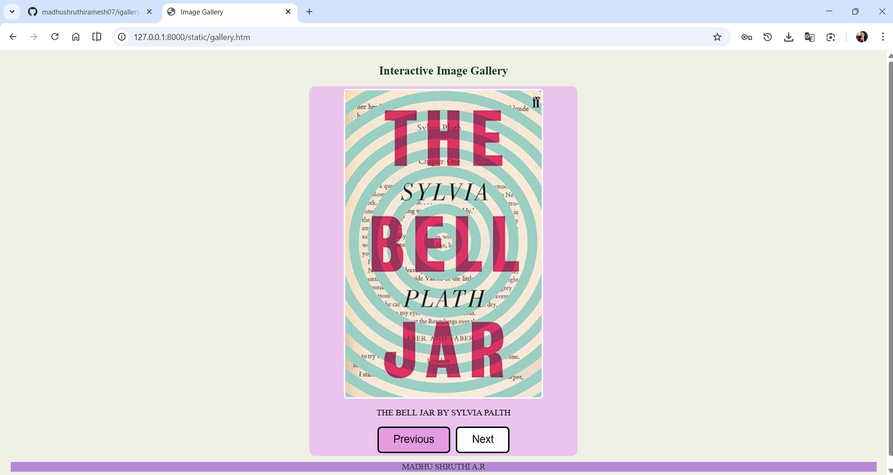
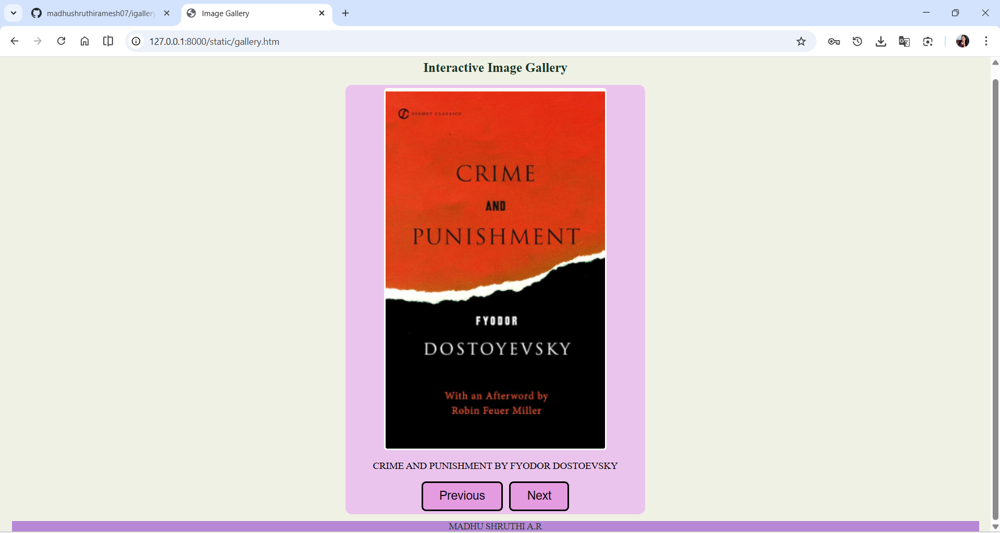
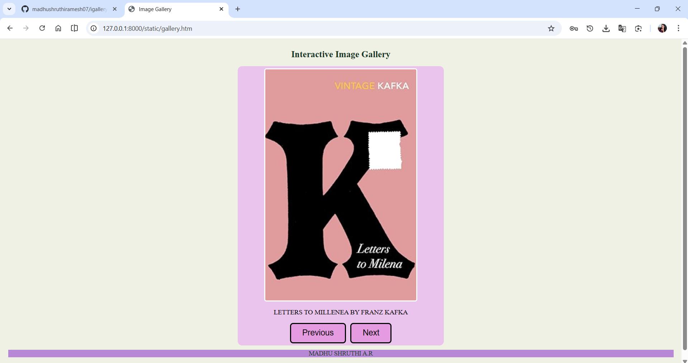
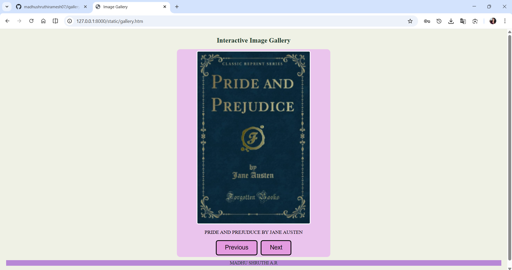
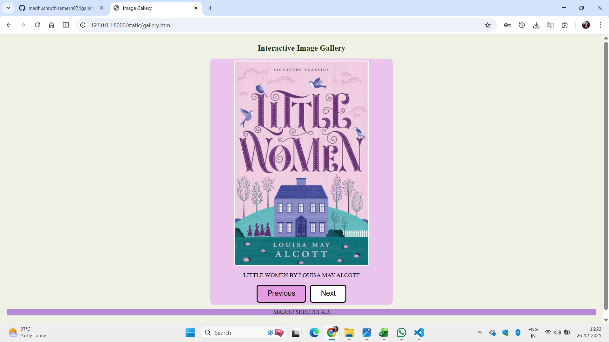

# Ex.07 Design of Interactive Image Gallery
## Date: 26-12-2025

## AIM:
To design a web application for an inteactive image gallery for a minimum five images with next and previous buttons.

## DESIGN STEPS:

### Step 1:
Clone the github repository and create Django admin interface.

### Step 2:
Change settings.py file to allow request from all hosts.

### Step 3:
Use CSS for positioning and styling.

### Step 4:
Write JavaScript program for implementing interactivity.

### Step 5:
Validate the HTML and CSS code.

### Step 6:
Publish the website in the given URL.

## PROGRAM:
```
gallery.html
<html>
<head>
    <title>Image Gallery</title>
    <link rel="stylesheet" href="gallery.css">
</head>
<body>

    <div class="top-banner">Interactive Image Gallery</div>

    <div class="content">
        <div class="container">
            
            <div id="caption" class="caption">THE BELL JAR BY SYLVIA PALTH</div>
            <div class="gallery-buttons">
                <button onclick="prevImage()">Previous</button>
                <button onclick="nextImage()">Next</button>
            </div>
        </div>
    </div>

    <script src="gallery.js"></script>
</body>
<footer>
    MADHU SHRUTHI A.R
</footer>
</html>
```

```
gallery.css
body {
    display: flex;
    flex-direction: column;
    height: 100vh;
    background-color: #eff1e5;
}

.top-banner {
    color: rgb(27, 52, 36);
    text-align: center;
    padding: 5px;
    font-size: 20px;
    font-weight: bold;
    margin: 10px;
}

.content {
    display: flex;
    justify-content: center;
    align-items: center;
}

.container {
    background: rgb(234, 196, 237);
    padding: 5px;
    border-radius: 10px;
    text-align: center;
    width: 450px;
}

.gallery-image {
    width: 75%;
    height:auto;
    object-fit: cover;
    border: solid #fcfdfd;
    border-radius: 5px;
}

.caption {
    margin: 15px;
    font-size: 15px;
    font-weight: 500;
}

.gallery-buttons {
    display: flex;
    justify-content: center;
    gap: 10px;
}

button {
    padding: 10px 25px;
    cursor: pointer;
    border: solid black;
    border-radius: 7px;
    background-color: #e49be0;
    color: rgb(12, 5, 11);
    font-size: 18px;
}

button:hover {
    background-color: #fcfdfd;
}

footer {
    background-color: #b788d6;
    color: rgb(27, 52, 36);
    text-align: center;
    font-size: 14px;
    font-weight: 500;
    margin: 10px;
}
```

```
gallery.js
const gallery = [ 
{ src: "thebelljar.png", caption: "THE BELL JAR BY SYLVIA PALTH" }, 
{ src: "crimeand.png", caption: "CRIME AND PUNISHMENT BY FYODOR DOSTOEVSKY" }, 
{ src: "letterstomilenia.png", caption: "LETTERS TO MILLENEA BY FRANZ KAFKA" }, 
{ src: "prideand.png", caption: "PRIDE AND PREJUDUCE BY JANE AUSTEN" },
{ src: "littlewomen.png", caption: "LITTLE WOMEN BY LOUISA MAY ALCOTT"},
]; 
let index = 0;

function updateGallery() {
    document.getElementById("galleryImage").src = gallery[index].src;
    document.getElementById("caption").textContent = gallery[index].caption;
}

function nextImage() {
    index++;
    if (index >= gallery.length) {
        index = 0;
    }
    updateGallery();
}

function prevImage() {
    index--;
    if (index < 0) {
        index = gallery.length - 1;
    }
    updateGallery();
}
```
## OUTPUT:











## RESULT:
The program for designing an interactive image gallery using HTML, CSS and JavaScript is executed successfully.
